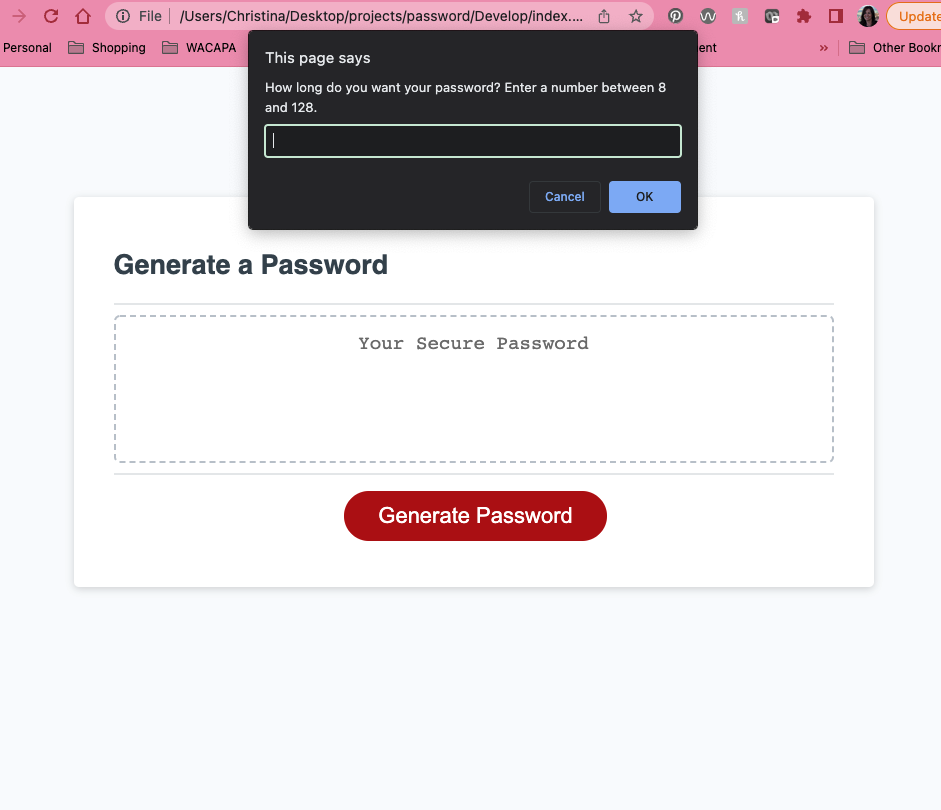

# Password Generator

## Description
When someone needs a new, secure password
they can click the button to generate a random password that is to their preferences. They will answer a series of prompts for their choices:
1) choose a length of at least 8 characters and no more than 128 characters
2) choose to include lowercase, uppercase, numeric, and/or special characters by individual prompt
Their answers are validated - the user must pick at least one character style.

A password is then generated that matches the selected criteria
displayed in the return box on the page.

## Issues
- Had to make sure that the password loop would continue until the password was the correct length.

- Needed to correct when alphabetic array was returning the number placement of the random letter rather than the letter.

- Had Git issues - I thought that I was committing to the GitHub repo but was only saving in the local repo. Figured it out when the project was done so there are not multiple commits to the GitHub repo.

## Screenshot

## Contact
Christina DuWors 
christinaduwors@gmail.com 
github.com/cduwors

GitHub Repository: https://github.com/cduwors/password

Deployed application: https://cduwors.github.io/password/

